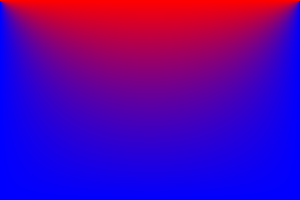

# numkit

A numerical computing library written from scratch in modern C++, with no
external dependencies.

**The problem it solves:** predict the steady-state temperature at every
point of a heated plate. Mathematically this means solving Laplace's
equation, a partial differential equation; numkit discretizes it with
finite differences and solves the resulting sparse linear system
(~10⁴–10⁵ unknowns) with iterative methods — the same pipeline at the
core of computational fluid dynamics and finite element software.

*Steady-state temperature field on a 300×200 plate with the top edge held
at 100° and the remaining edges at 0°, solved with SOR and rendered to PPM
by the library.*

## What it does

* **Discretization** — the continuous PDE is sampled on a uniform grid, and
  second derivatives are replaced with central finite differences, reducing
  the problem to a sparse linear system (one equation per interior point).
* **Iterative solvers** — Jacobi, Gauss-Seidel, and SOR, implemented from
  scratch and validated against each other and against exact solutions.
* **Parallelism** — a multithreaded Jacobi solver (std::thread) with a
  measured, diagnosed speedup study.
* **Visualization** — solved fields are rendered to PPM images with a
  blue-to-red color map.

## Results

* **Verified second-order convergence** against manufactured analytical
  solutions: refining the grid 2× reduces error 4× (measured ratios 4.17,
  4.11 vs. the theoretical 4.0). Study: [docs/validation.md](docs/validation.md).
* On a 10×10 test problem, Jacobi / Gauss-Seidel / SOR converge in
  237 / 124 / 29 sweeps — SOR at its measured optimal relaxation factor
  (ω = 1.50, theory ~1.53) is 8× cheaper than Jacobi.
  Study: [docs/omega_study.md](docs/omega_study.md).
* Multithreaded Jacobi reaches 1.63× speedup at 2 threads; the study
  identifies memory bandwidth as the ceiling and per-sweep thread respawn
  as the cost of going wider. Study:
  [docs/threading_study.md](docs/threading_study.md).

## Roadmap

**Heat Solver**
* [x] Grid data structure for 2D scalar fields
* [x] Jacobi, Gauss-Seidel, and SOR iterative solvers
* [x] 2D steady-state heat solver (`apps/heat`) with PPM heatmap output
* [x] Convergence and validation studies in `docs/`
* [x] Multithreaded Jacobi solver

**Truss Solver**
* [ ] 2D truss finite element solver 

## Building

Requires g++ and make. From the repo root:

    make

builds the test programs and the heat app. Run `./heat.exe` to solve the
demo problem and write `heat.ppm`.

## License

MIT
