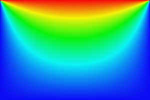
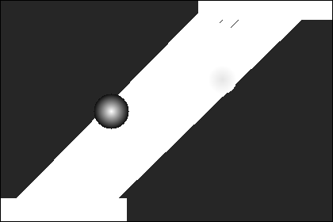
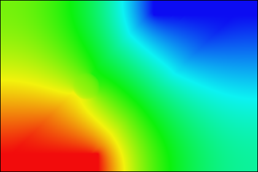
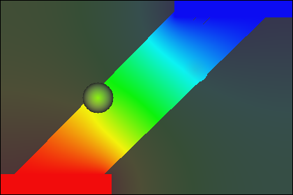
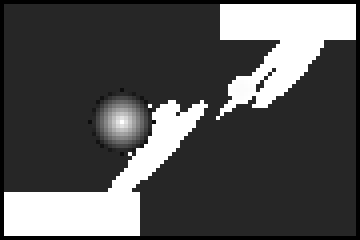
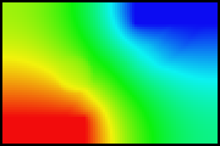
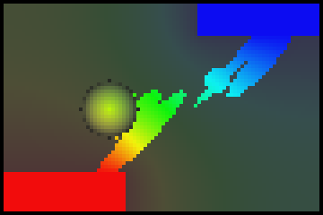
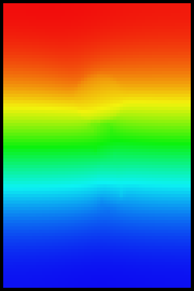
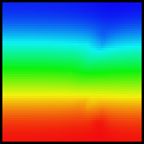
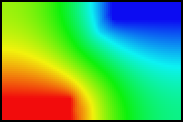

# NumKit
[](https://github.com/jyahdi-byte/numkit/actions/workflows/build.yml)
[](LICENSE)
[](https://en.cppreference.com/w/cpp/20)
[](https://developer.nvidia.com/cuda-toolkit)

**C++ library for elliptic PDEs** — finite-difference discretization, multiple iterative solvers, irregular domains, multithreading, and CUDA, with rigorous verification and performance studies.

**Jonas Yahdi**  
Applied Mathematics / Computational Mathematics & Computer Science  
Santa Clara University

---

NumKit implements the full scientific-computing workflow for steady-state heat conduction and related elliptic problems:

```text
Mathematical model → Finite-difference discretization → Iterative solvers
→ Independent verification → Convergence studies → CPU parallelization
→ CUDA kernels → Benchmarking & analysis
```

The project answers two questions that matter in real engineering work:  
**Does the code produce a correct answer, and what limits its performance?**

---

## Results at a glance

| Basic steady-state heat flow | With circular insulated obstacle | Narrow openings (slits) |
|:----------------------------:|:--------------------------------:|:-----------------------:|
|  |  |  |

**Variable-conductivity “lens” demo** (low-conductivity background + high-conductivity fins + smooth conductivity bumps, solved with multithreaded red-black SOR):

| Conductivity field | Temperature solution | Composite view |
|:------------------:|:--------------------:|:--------------:|
|  |  |  |

**3D extension** — the same variable-conductivity lens problem, now solved on a full three-dimensional grid (`Grid3D`) and inspected through 2D slices:

| Conductivity (k-slice) | Temperature after solving | Composite view |
|:-----------------------:|:--------------------------:|:---------------:|
|  |  |  |

Slicing along all three axes confirms the field is genuinely 3-D, not a stack of identical 2-D solves:

| i-axis slice | j-axis slice | k-axis slice (3/4 depth) |
|:-------------:|:-------------:|:--------------------------:|
|  |  |  |

These images are generated by the applications in `apps/heat/` (`main_lens.cpp` for 2D, `main_lens_3d.cpp` for 3D, using `slice_grid.hpp` to extract 2D slices from the `Grid3D` field).

---

## What this project demostrates

- **Numerical methods** — finite differences for elliptic PDEs, iterative solvers, convergence-order verification, error analysis
- **C++ systems programming** — C++20, clear memory layout, reusable components, assertions, multithreading, synchronization primitives
- **Parallel computing** — data-dependency analysis, red-black ordering, persistent worker threads + `std::barrier`, race-free updates
- **GPU computing** — CUDA kernels, shared-memory tiling, host/device validation, block-size experiments
- **Scientific software practices** — manufactured solutions, cross-solver checks, conservation tests, CI, reproducible studies with written analysis

The repository includes studies that explain *why* measured behavior differs from ideal theory (non-linear speedups, modest GPU gains on small problems, limited benefit of simple preconditioning on irregular domains). 

---

## What is implemented

### Solvers
- Jacobi
- Gauss-Seidel
- Successive Over-Relaxation (SOR)
- Red-black Gauss-Seidel and SOR (parallel-friendly)
- Conjugate Gradient (matrix-free)
- Preconditioned CG (diagonal/Jacobi preconditioner)

Every solver above is implemented for both the 2D grid (`Grid`) and the 3D grid (`Grid3D`), single-threaded, multithreaded, and (where noted below) on the GPU.

### Grid model
Dense storage with typed cells, in 2D (`Grid`) and 3D (`Grid3D`):

```text
INTERIOR  → unknown updated by the solver
FIXED     → Dirichlet boundary / internal fixed values
HOLE      → insulated region (ghost-point reflection enforces zero normal flux)
```

`Grid3D` mirrors `Grid` with a 6-face (i/j/k neighbor) stencil in place of the 2D 4-face stencil. The same representation is used by all CPU solvers and CUDA kernels, in both 2D and 3D.

### Additional capabilities
- Spatially varying conductivity (harmonic face averaging, 4-face in 2D / 6-face in 3D)
- Irregular and embedded domains (circles, rectangles, slits, internal fixed regions)
- Multithreaded red-black variants (2D and 3D)
- CUDA implementations (naive + shared-memory tiled Jacobi, red-black Gauss-Seidel & SOR, all ported to 3D)
- PPM visualization helpers, including axis-aligned 2D slicing of `Grid3D` fields (`slice_grid.hpp`)

Demonstrated end-to-end in `apps/heat/main_lens.cpp` (2D) and `apps/heat/main_lens_3d.cpp` (3D), and related applications.

---

## Verification

A numerical code is only useful if its results can be trusted independently.

### Manufactured-solution convergence
The solvers are checked against the exact solution

$$
T(x,y) = \sin(\pi x)\sinh(\pi y)
$$

Grid-refinement study (expected second-order → factor of ≈4):

| Grid change | Measured error ratio |
|-------------|---------------------:|
| 25 → 50     |                4.17  |
| 50 → 100    |                4.11  |

Full details in [`docs/validation.md`](docs/validation.md).

### Cross-solver agreement
Different algorithms must converge to the same physical solution. Representative sweep counts on one test problem:

| Method                     | Sweeps |
|----------------------------|-------:|
| Jacobi                     |    298 |
| Gauss-Seidel               |    154 |
| SOR (ω = 1.5)              |     41 |
| SOR (theoretical ω)        |     40 |
| Conjugate Gradient         |     28 |
| Preconditioned CG          |     27 |

Additional automated checks cover fixed-cell invariance, symmetry, boundary behavior, and tight CPU↔CUDA agreement.

### 3D
The 3D Jacobi solver is checked against a manufactured linear solution (converges in 287 sweeps). All 3D solvers — single- and multithreaded CPU, and CUDA — are cross-validated against each other and against the single-threaded `Grid3D` reference across multiple thread counts and grid sizes, via `tests/test_solvers3d.cpp` and `tests/cuda/cuda_solvers_validate_3d.cu`.

---

## Key algorithmic studies

### SOR relaxation parameter
Experimental sweep of ω compared against the theoretical optimum for rectangular grids.  
→ [`docs/omega_study.md`](docs/omega_study.md)

### Red-black ordering
Enables parallel updates while preserving convergence behavior:

| Method                 | Sweeps (80×80) |
|------------------------|---------------:|
| Gauss-Seidel           |         11 346 |
| Red-black Gauss-Seidel |         11 365 |
| SOR                    |            323 |
| Red-black SOR          |            321 |

→ [`docs/red_black_study.md`](docs/red_black_study.md)

### Conjugate Gradient scaling (matrix-free)
| Grid size | Gauss-Seidel | SOR | CG  |
|----------:|-------------:|----:|----:|
|        10 |          179 |  39 |  24 |
|        20 |          756 |  80 |  60 |
|        40 |        2 977 | 161 | 124 |
|        80 |       11 346 | 323 | 252 |

Diagonal preconditioning produced little benefit on the irregular geometries tested; the negative result is documented.  
→ [`docs/conjugate_gradient_study.md`](docs/conjugate_gradient_study.md)

---

## CPU parallelization

- Jacobi: straightforward parallelization + persistent worker pool using `std::barrier`
- Red-black Gauss-Seidel / SOR: color-synchronized parallel updates driven by the numerical dependency graph

All three multithreaded solvers (`jacobi_mt`, `gauss_seidel_rb_mt`, `sor_rb_mt`) are also implemented for `Grid3D`, reusing the same persistent worker-pool architecture. Partitioning switches from row-chunking (2D) to depth-chunking (3D interior split along k, with i/j always run in full), and the red-black parity check was re-verified at chunk boundaries with no races, cross-validated against the single-threaded `Grid3D` solvers across thread counts 1/3/4/5/8.

Representative scaling result:

| Threads | Runtime | Speedup |
|--------:|--------:|--------:|
|       1 |   152 s |   1.00× |
|       2 |    93 s |   1.63× |
|       4 |   110 s |   1.38× |
|       8 | 107.8 s |   1.41× |

Limited by memory bandwidth, synchronization cost, and hardware constraints — not by “more threads must be faster.”  
→ [`docs/threading_study.md`](docs/threading_study.md)

---

## CUDA implementation

Incremental development path:

```text
CPU reference → Naive kernel → Correctness validation
→ Shared-memory tiled kernel → Block-size sweep → Analysis
```

**100×100 fixed-work benchmark (Tesla T4)**

| Implementation       | Mean time | Speedup vs. CPU |
|----------------------|----------:|----------------:|
| CPU (single thread)  | 113.09 ms |           1.00× |
| CUDA naive           |  93.69 ms |           1.21× |
| CUDA shared-memory   | **85.48 ms** |       **1.32×** |

The modest speedup is expected: Jacobi is memory-bound, the problem size is modest, and kernel-launch overhead is visible. The study focuses on diagnosing the bottleneck rather than claiming large gains.  
→ [`docs/gpu_speedup_study.md`](docs/gpu_speedup_study.md)

A halo-loading bug in the tiled kernel (ragged block sizes) was caught by the CPU↔GPU validation suite — an example of why independent numerical checks are essential for parallel code.

### 3D CUDA kernels
All four kernels — `jacobi_kernel`, `gauss_seidel_rb_kernel` (red/black), `sor_rb_kernel` (red/black) — are overloaded for `Grid3D`, using a flattened 1D thread index over the interior with plane-based unflattening back to (i, j, k); red-black parity extends naturally to `(i + j + k) % 2`. `jacobi_tiled_kernel` was redesigned for 3D with a 3D block/shared-memory tile and 6-face halo loading (up/down/left/right/front/back), replacing the 2D version's 4-face halo.

All four 3D kernels are cross-validated against the single-threaded `Grid3D` CPU solvers in `tests/cuda/cuda_solvers_validate_3d.cu` and pass on GPU hardware (Jacobi 325 sweeps, Gauss-Seidel-RB 169 sweeps, SOR-RB 37 sweeps, tiled-vs-untiled agreement over 5000 sweeps). Timing benchmarks for the 3D kernels (`tests/cuda/bench_gpu_3d.cu`, `tests/cuda/bench_tiled_sweep_3d.cu`) exist alongside their 2D counterparts but don't yet have a written results table here — see `docs/gpu_speedup_study.md` for the 2D numbers this would extend.

---

## Build and run

### Requirements
- **CPU**: modern C++20 toolchain, `make` (Linux / macOS / WSL)
- **GPU**: NVIDIA GPU + CUDA toolkit (`nvcc`)

CI uses CUDA Toolkit 12.4 for compile-time checks (GitHub-hosted runners have no GPU).

```bash
# Build all CPU targets
make all

# Core correctness tests (2D)
./test_solvers.exe
./test_grid.exe
./test_jacobi.exe
./test_omega_auto.exe

# Core correctness tests (3D)
./test_grid3d.exe
./test_jacobi3d.exe
./test_solvers3d.exe
./test_slice_grid3d.exe

# Heat-flow demos (writes PPM images)
./heat.exe
./heat.exe --obstacle

# CUDA targets (requires NVIDIA GPU)
make cuda-test
make jacobi-validate
make jacobi-tiled-validate
make gauss-seidel-rb-validate
make sor-rb-validate
make bench-gpu
make bench-tiled-sweep

# CUDA targets — 3D (requires NVIDIA GPU)
make cuda-solvers-validate-3d
make bench-gpu-3d
make bench-tiled-sweep-3d
```

Additional applications are in `apps/heat/` (`main_lens.cpp`, `main_slits.cpp`, …).

---

## Repository structure

```text
numkit/
├── include/                 # Core library headers + CUDA kernels
│   ├── grid.hpp              # Grid (2D) and Grid3D (3D)
│   ├── jacobi*.hpp / *.cuh
│   ├── gauss_seidel*.hpp / *.cuh
│   ├── sor*.hpp / *.cuh
│   ├── conjugate_gradient.hpp
│   ├── slice_grid.hpp        # axis-aligned 2D slices of a Grid3D field
│   └── ppm.hpp
├── apps/heat/               # Demonstration applications
│   ├── main.cpp / main_slits.cpp / main_lens.cpp   # 2D
│   └── main_lens_3d.cpp                            # 3D
├── tests/                   # Correctness tests, parameter sweeps, benchmarks
│   ├── test_grid3d.cpp, test_jacobi3d.cpp, test_gauss_seidel3d.cpp,
│   │   test_sor3d.cpp, test_solvers3d.cpp, test_slice_grid3d.cpp   # 3D
│   └── cuda/
│       └── cuda_solvers_validate_3d.cu, bench_gpu_3d.cu,
│           bench_tiled_sweep_3d.cu                                # 3D
├── docs/                    # Written studies + images
│   ├── images/
│   ├── validation.md
│   ├── omega_study.md
│   ├── red_black_study.md
│   ├── threading_study.md
│   ├── conjugate_gradient_study.md
│   └── gpu_speedup_study.md
├── .github/workflows/
├── Makefile
└── README.md
```

---

## Technical stack

| Area                | Technologies                                              |
|---------------------|-----------------------------------------------------------|
| Language            | C++20                                                     |
| GPU                 | CUDA / `nvcc`                                             |
| Numerical methods   | Finite differences, iterative solvers, CG, relaxation     |
| PDEs                | Elliptic / steady-state diffusion and heat conduction     |
| Parallelism         | `std::thread`, `std::barrier`, red-black ordering, CUDA   |
| GPU optimization    | Shared memory, tiling, block-size experiments             |
| Validation          | Manufactured solutions, cross-solver checks, CPU↔GPU      |
| Performance         | Fixed-work benchmarks, speedup and scaling studies        |
| Tooling             | Make, GitHub Actions                                      |

---

## Skills demonstrated

- Translating a continuous mathematical model into a discrete numerical algorithm
- Implementing and comparing multiple iterative solvers on the same problem
- Verifying correctness against analytical solutions and independent implementations
- Representing irregular domains and variable material properties
- Analyzing data dependencies that constrain parallelism
- Redesigning algorithms for race-free multithreaded execution
- Porting stencil computations to CUDA and optimizing memory access patterns
- Benchmarking and interpreting non-ideal scaling behavior
- Debugging numerical and parallel code with targeted validation suites
- Documenting experiments so results can be reproduced and critiqued

---

## Scope and possible extensions

NumKit focuses on **elliptic PDEs**. Time-dependent solvers and a Black-Scholes implementation live in a separate project.

Natural next steps that build on the existing architecture:
- Expanded automated coverage for edge cases and complex geometries
- Real-GPU execution testing in CI (beyond compile-only checks)
- Stronger statistical controls for benchmarks
- Sparse-matrix representations for larger problem sizes
- More effective preconditioners for irregular and variable-coefficient systems
- 3D CUDA benchmark results written up (kernels exist and are validated; timing study is not yet documented)

---

## Further reading

- [`docs/validation.md`](docs/validation.md) — manufactured solutions and error analysis
- [`docs/omega_study.md`](docs/omega_study.md) — SOR parameter selection
- [`docs/red_black_study.md`](docs/red_black_study.md) — race-free ordering
- [`docs/threading_study.md`](docs/threading_study.md) — CPU scaling behavior
- [`docs/conjugate_gradient_study.md`](docs/conjugate_gradient_study.md) — CG and preconditioning
- [`docs/gpu_speedup_study.md`](docs/gpu_speedup_study.md) — CPU vs. CUDA performance analysis

---

## Author

**Jonas Yahdi**  
Mathematics & Computer Science  
Santa Clara University

- GitHub: [jyahdi-byte](https://github.com/jyahdi-byte)
- LinkedIn: [Jonas Yahdi](https://www.linkedin.com/in/jonas-yahdi-b00a1a226/)
- Email: [jyahdi@scu.edu](mailto:jyahdi@scu.edu) · [jyahdi@gmail.com](mailto:jyahdi@gmail.com)

## License

MIT — see [`LICENSE`](LICENSE).