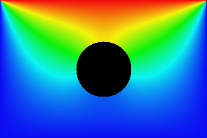
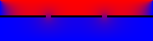

# NumKit

A C++ numerical computing library focused on **finite-difference PDE solvers, numerical verification, convergence analysis, CPU parallelism, and CUDA acceleration**.

NumKit explores the full numerical-computing workflow:

```text
Mathematical Model
        ↓
Finite-Difference Discretization
        ↓
Numerical Solver
        ↓
Analytical / Physical Validation
        ↓
Convergence & Stability Analysis
        ↓
CPU Parallelization
        ↓
CUDA Acceleration
        ↓
Performance Analysis
```

The goal is not simply to produce a numerical answer, but to understand **why the answer should be trusted and how efficiently it can be computed**.

---

## Highlights

- Implemented finite-difference solvers for **elliptic, parabolic, and hyperbolic PDEs**
- Implemented **Jacobi, Gauss-Seidel, and SOR** iterative methods
- Validated numerical solutions against analytical solutions
- Performed grid-refinement and convergence studies
- Investigated CFL and diffusion stability limits
- Built conservation-based numerical tests
- Parallelized Jacobi iteration with C++ threads
- Developed a persistent worker model using `std::barrier`
- Implemented CUDA Jacobi kernels
- Optimized CUDA Jacobi with shared-memory tiling
- Benchmarked CPU, naive CUDA, and tiled CUDA implementations
- Built automated numerical tests and GitHub Actions CI
- Investigated numerical error, memory bandwidth, synchronization overhead, and GPU kernel-launch overhead
- Implemented embedded-boundary domains with Dirichlet and Neumann (insulated) obstacles

---

# Numerical Methods

## Elliptic PDEs

NumKit solves steady-state elliptic problems such as Laplace's equation:

∇²T = 0

Implemented iterative methods:

- Jacobi
- Gauss-Seidel
- Successive Over-Relaxation (SOR)

### Analytical Validation

The solver is validated against the manufactured solution:

T(x, y) = sin(πx) sinh(πy)

Grid refinement produces approximately second-order convergence:

| Grid Refinement | Error Ratio |
|---|---:|
| 25 → 50 | 4.17 |
| 50 → 100 | 4.11 |

For a second-order method, halving the grid spacing should reduce the error by approximately:

2² = 4

The measured ratios closely match the theoretical prediction.

---

## SOR Parameter Study

SOR introduces the relaxation parameter:

ω

NumKit sweeps the relaxation parameter experimentally and measures the iterations required for convergence.

The measured optimum occurs around:

ω ≈ 1.50

This is compared against the theoretical estimate:

ω_opt ≈ 2 / (1 + sin(πh))

This provides a direct comparison between numerical-analysis theory and measured computational behavior.

---

## Embedded Boundary / Irregular Domains

NumKit extends the elliptic solvers to grids containing holes and embedded
obstacles, using a per-cell classification layered onto the existing dense
grid. Each cell is one of three types:

- `INTERIOR` — updated normally by the solver
- `FIXED` — held at a constant value (Dirichlet), e.g. the outer boundary
  ring or an embedded object at fixed temperature
- `HOLE` — excluded from the domain, insulated (Neumann / zero-flux)

### Dirichlet Obstacles

A `FIXED` region behaves like a boundary condition sitting inside the
domain instead of around its edge. Neighboring interior cells read its
value directly, and the cell itself is never updated.

### Neumann (Insulated) Obstacles

A `HOLE` models empty or insulated space, where no heat crosses its
boundary. This can't be implemented by simply excluding the missing
neighbor from the 4-point average — that changes the iterative update
rule, not just the steady-state answer.

Instead, NumKit uses a ghost-point reflection. The denominator stays
fixed at 4, and any neighbor that is a `HOLE` is replaced by the center
cell's own current value before the average is taken:

T_new(i,j) = (T_up + T_down + T_left + T_right) / 4

**Validation:**

- At steady state, this reduces algebraically to averaging over only the
  real neighbors — the answer one might guess intuitively, but derived
  here rather than assumed.
- Near an insulated boundary, the temperature gradient measurably
  flattens relative to the ambient gradient elsewhere in the same grid,
  consistent with zero flux crossing the wall.

Implemented across every elliptic solver: Jacobi, Gauss-Seidel, SOR,
threaded Jacobi, and the CUDA kernel.

### Geometry Helpers

- `maskRect(i0, j0, i1, j1, type)` — carves a rectangular region
- `maskCircle(ci, cj, r, type)` — carves a circular region, using
  (i − ci)² + (j − cj)² ≤ r²

### Demo

`apps/heat/main.cpp` accepts an `--obstacle` flag, placing a circular
insulated obstacle at the center of the domain. `HOLE` cells render in
black so the obstacle is visually distinct from the surrounding
temperature field.



A second demo, `apps/heat/main_slits.cpp`, places two narrow gaps in an
otherwise insulated wall. Heat spreads through each gap and merges
downstream — diffusion doesn't produce the interference fringes a wave
equation would, but the two streams are visibly distinguishable before
they blend into one uniform region.



---

# Hyperbolic PDEs

NumKit implements an upwind finite-difference solver for the 1D advection equation:

u_t + c u_x = 0

Features include:

- Periodic boundary conditions
- Courant-number calculation
- CFL stability analysis
- Exact-solution comparison
- Numerical-diffusion experiments

For the exact solution,

u(x, t) = u₀(x − ct)

the numerical solution can be compared directly against the translated initial condition.

The repository also includes deliberate CFL-violation experiments to demonstrate instability when the stability condition is exceeded.

---

# Parabolic PDEs

NumKit implements Forward-Time Centered-Space (FTCS) for the 1D diffusion equation:

u_t = α u_xx

with stability parameter:

r = α Δt / Δx²

and explicit stability condition:

r ≤ 1/2

Features include:

- FTCS diffusion solver
- Gaussian analytical solution
- Conservation testing
- Stability-violation experiments
- Grid-refinement studies
- Error analysis

## Diffusion Convergence Study

The convergence experiments hold

r = α Δt / Δx²

constant while refining the spatial grid.

Therefore,

Δt ∝ Δx²

Measured refinement ratios include:

```text
4.01
4.00
4.00
```

matching the expected second-order behavior.

At the finest resolution, the measured ratio begins to deviate as the number of time steps becomes very large, providing an example of accumulated floating-point error becoming more significant relative to discretization error.

---

# CPU Parallelization

Jacobi iteration is naturally parallel because each grid point in a sweep depends only on values from the previous iteration.

NumKit includes a multithreaded implementation using C++ threads.

Example benchmark:

| Threads | Runtime | Speedup |
|---:|---:|---:|
| 1 | 152 s | 1.00× |
| 2 | 93 s | 1.63× |
| 4 | 110 s | 1.38× |
| 8 | 107.8 s | 1.41× |

The results demonstrate that increasing thread count does not automatically produce proportional speedup.

The project investigates:

- Memory-bandwidth limitations
- Thread-management overhead
- Physical vs. logical CPU cores
- Synchronization costs

The implementation was subsequently redesigned around a persistent worker model using `std::barrier` to reduce repeated thread-creation overhead.

The important result was not simply the speedup number, but using the benchmark to identify a performance bottleneck and guide an implementation change.

---

# CUDA Acceleration

The GPU implementation progressed through several stages:

```text
CPU Jacobi
    ↓
Naive CUDA Kernel
    ↓
Correctness Validation
    ↓
Shared-Memory Tiling
    ↓
Block-Size Experiments
    ↓
Performance Benchmarking
```

## Shared-Memory Tiling

The tiled CUDA implementation loads local grid regions and halo values into shared memory.

This reduces repeated global-memory accesses when neighboring values are reused by multiple threads.

The GPU implementation is validated against the CPU solver before performance comparisons.

## CPU vs. CUDA

Example benchmark:

| Implementation | Runtime |
|---|---:|
| CPU | 113.09 ms |
| CUDA — Naive | 93.69 ms |
| CUDA — Shared Memory | **85.48 ms** |

The tiled CUDA implementation achieves approximately:

1.32×

the CPU performance for this workload.

The modest GPU speedup is itself informative. Jacobi iteration is memory-dependent, the benchmark uses a relatively small problem size, and repeated kernel launches introduce overhead.

The project therefore treats GPU benchmarking as a performance investigation rather than simply trying to maximize the reported speedup.

---

# CUDA Debugging and Validation

During development, the tiled CUDA implementation contained a halo-loading bug for ragged block sizes.

The original implementation happened to pass a correctness check for one tested configuration.

Additional testing exposed the issue, after which the kernel was corrected and revalidated.

This reinforced a central development principle:

```text
Implementation
      ↓
Validation
      ↓
Unexpected Behavior
      ↓
Bug Identification
      ↓
Correction
      ↓
Revalidation
```

Numerical software should not be trusted simply because its output looks plausible.

---

# Verification

NumKit separates **unit tests, numerical experiments, and performance benchmarks**.

### Unit Tests

Test individual components and expected behavior:

- Grid indexing
- Solver outputs
- Exact solutions
- Conservation
- Boundary behavior

### Numerical Experiments

Investigate mathematical behavior:

- Convergence studies
- Stability-limit experiments
- SOR parameter sweeps
- Numerical diffusion
- CPU scaling
- CUDA block-size comparisons

### Benchmarks

Measure computational performance:

- Single-thread vs. multithreaded CPU execution
- Naive vs. tiled CUDA
- Different CUDA block sizes
- Synchronization and memory effects

This separation makes it possible to distinguish:

**"Is the algorithm correct?"**

from

**"How does the algorithm behave numerically?"**

and

**"How efficiently is it implemented?"**

---

# Testing and CI

NumKit uses C++ assertions and automated tests to verify numerical behavior.

Example:

```cpp
assert(std::abs(u.at(i) - 1) < 1e-9);
```

Conservation checks include:

```cpp
assert(std::abs(sum_after - sum_before) < 1e-9);
```

GitHub Actions automatically builds and runs tests on repository changes.

The objective is to make numerical regressions fail automatically rather than relying only on manually inspected output.

---

# Repository Structure

```text
numkit/
├── include/
│   ├── grid.hpp
│   ├── jacobi.hpp
│   ├── gauss_seidel.hpp
│   ├── sor.hpp
│   ├── advection.hpp
│   ├── diffusion.hpp
│   └── ...
│
├── cuda/
│   ├── jacobi.cu
│   ├── jacobi_tiled.cu
│   └── ...
│
├── tests/
│   ├── test_grid.cpp
│   ├── test_jacobi.cpp
│   ├── test_diffusion.cpp
│   ├── test_advection.cpp
│   ├── test_convergence.cpp
│   └── ...
│
├── experiments/
│   ├── convergence/
│   ├── stability/
│   ├── cpu/
│   └── cuda/
│
├── docs/
│   ├── convergence.md
│   ├── diffusion.md
│   ├── advection.md
│   └── ...
│
└── .github/
    └── workflows/
```

---

# Technical Stack

### Languages

- C++
- CUDA
- Python for supporting analysis and visualization where applicable

### Numerical Computing

- Finite-difference methods
- Iterative linear solvers
- PDE discretization
- Stability analysis
- Convergence analysis
- Numerical error analysis

### Parallel Computing

- C++ threads
- `std::barrier`
- CUDA
- CUDA shared memory
- GPU kernel optimization

### Development

- Git
- GitHub
- GitHub Actions
- Automated testing
- Performance benchmarking

---

# What This Project Demonstrates

NumKit is an exploration of the relationship between **mathematics, numerical algorithms, and computer architecture**.

The project demonstrates the ability to:

- Translate mathematical equations into computational algorithms
- Validate numerical implementations against independent analytical results
- Measure convergence and compare it against theoretical predictions
- Identify stability constraints and deliberately test their failure modes
- Parallelize numerical algorithms on CPUs
- Develop and optimize GPU kernels
- Use benchmarking to investigate performance bottlenecks
- Debug numerical and parallel implementations
- Build automated tests around scientific computations

The central workflow is:

```text
Mathematical Theory
        ↓
Implementation
        ↓
Verification
        ↓
Experiment
        ↓
Benchmark
        ↓
Optimization
        ↓
Revalidation
```

---

# Future Development

The long-term goal is to evolve NumKit from a collection of numerical experiments into a more reusable numerical-computing framework.

Planned directions include:

- Additional iterative linear solvers
- Conjugate Gradient
- GMRES
- More reusable PDE/discretization abstractions
- 2D and 3D extensions
- More advanced CUDA implementations
- CUDA event-based benchmarking
- GPU profiling and occupancy analysis
- Larger-scale performance studies
- More comprehensive numerical regression testing
- Black-Scholes PDE implementation and validation

The focus is on making the numerical machinery increasingly **general, verifiable, and performance-aware**.

---

# Project Philosophy

> **A numerical algorithm is not finished when it produces an answer. It is finished when the answer has been validated, its error and stability are understood, and its computational behavior has been measured.**

NumKit combines:

```text
Mathematics
     +
Numerical Analysis
     +
C++ Systems Programming
     +
Parallel Computing
     +
GPU Computing
     +
Experimental Validation
```

into one continuously evolving project.

---

# Author

**Jonas Yahdi**

Applied Mathematics / Computational Mathematics & Computer Science  
Santa Clara University

GitHub: [jyahdi-byte](https://github.com/jyahdi-byte)
LinkedIn: [Jonas Yahdi](https://www.linkedin.com/in/jonas-yahdi-b00a1a226/)
Email: jyahdi@scu.edu (school) · jyahdi@gmail.com (personal)

## License

MIT